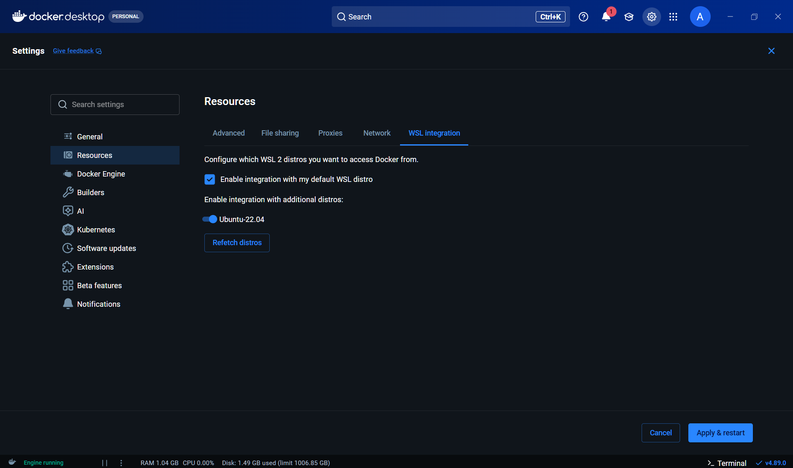
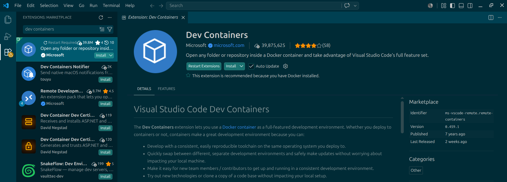
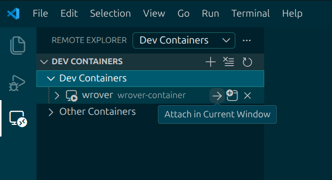
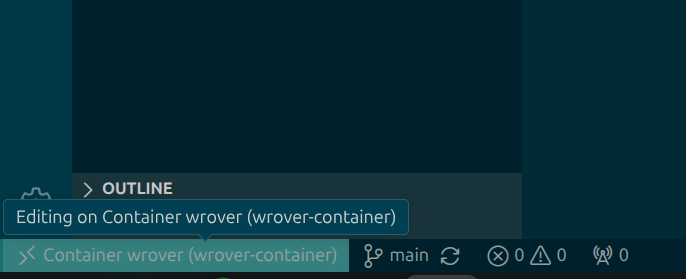
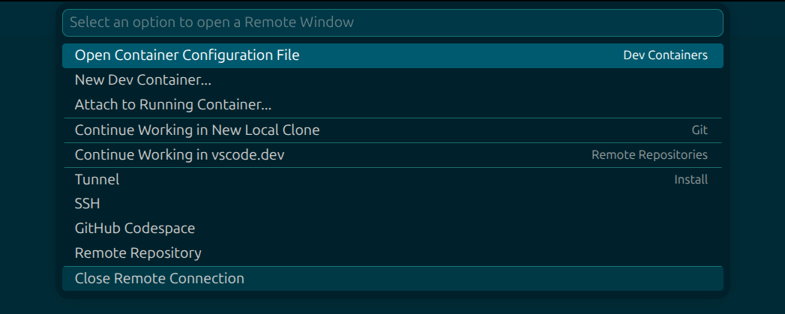

# WRoverSoftware_Docker

Docker environment running Ubuntu 22.04 with ROS 2 Humble and Python dependencies.

Used for software development for Wisconsin Robotics.

## Requirements

- Install [WSL2](https://learn.microsoft.com/en-us/windows/wsl/install) if on Windows.

  > **IMPORTANT:** All terminal commands should run in the WSL terminal on Windows.

- Install and configure Git and SSH (see [Git and SSH Setup](https://docs.google.com/document/d/1nh3XB0kvj7EMDJ3YU6YeAWiVRyPPHRfj/edit#heading=h.nrnjvwt1hpnv)).

- Install [Docker Desktop on Windows](https://docs.docker.com/desktop/setup/install/windows-install/) or [Docker Desktop on Mac](https://docs.docker.com/desktop/setup/install/mac-install/).

- For Windows, connect Docker Desktop to the WSL distro in settings.

  

- Install make on Windows in a (WSL) terminal:

  ```bash
  sudo apt update && sudo apt install -y make
  ```

  Install make on Mac by installing [Xcode Command Line Tools](https://developer.apple.com/documentation/xcode/installing-the-command-line-tools/).

## Setup

- Create a workspace directory.

- Enter the workspace directory, then clone this repository.

  ```bash
  git clone git@github.com:WisconsinRobotics/WRoverSoftware_Docker.git
  ```

- Set it as a safe directory for Git.

  ```bash
  git config --global --add safe.directory /root/workspace/WRoverSoftware_Docker
  ```
  
## Build

- Make sure docker desktop is running.

- Navigate to this directory (WRoverSoftware_Docker) and enter:

  ```bash
  docker build -t wrover .
  ```
  
- If running into permission issues, see [this post](https://stackoverflow.com/questions/48957195/how-to-fix-docker-permission-denied).

## Run

- Once the Docker image has been built, it does not need to be rebuilt every time.
  
  Rebuild only when `Dockerfile` or `requirements.txt` changes.
  
- To run, open a terminal in **this directory** and enter:

  ```bash
  make run
  ```
  
- To exit, enter `exit` in the same terminal.

## Misc

### Adding other GitHub repositories

- Run the docker container.

- **Inside** the docker container, clone the repo into the workspace directory.

### Visual Studio Code setup

- Download [VS Code](https://code.visualstudio.com/download).
  
- Install the Dev Containers VS Code extension.
  
  
  
- Run the container in a separate terminal and attach the container through the extension by clicking the right arrow next to the `wrover` container under `Dev Containers`.
  
  
  
- To disconnect, click the bottom left corner, click `Close Remote Connection`, then shut down the container.
  
  
  
  

### Adding python packages

- Add the python package(s) which you want to add to the container in `requirements.txt`, one package per line.
  
  > For consistency, it's best to specify the package version, for example, `depthai==3.1.0`.
  
- After adding the package(s), rebuild the Docker container:
  
  ```bash
  docker build -t wrover .
  ```
  
- To push changes, open a PR (see [Git and CI/CD training]()).
